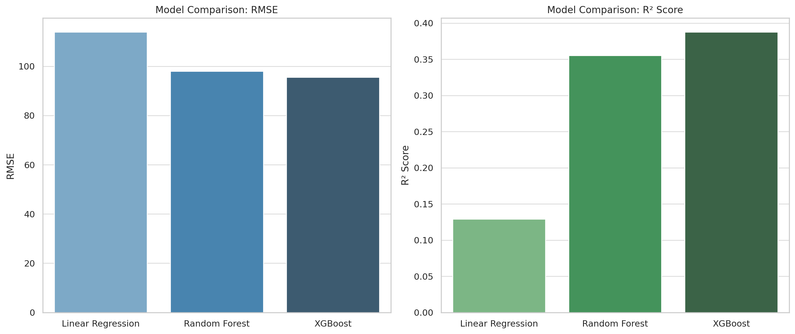

# Predicting rental price of an Airbnb listing in the U.S.

## NON-TECHNICAL EXPLANATION OF YOUR PROJECT
This project analyzes Airbnb listings across the U.S. to predict how much a rental might cost. By studying various factors like location, type of room, number of reviews, and availability, the goal is to build computer models that can estimate prices accurately. I tested different approaches—from simple to advanced—to see which predicts prices best.This helps travelers understand fair pricing and assists hosts in setting competitive rates. Ultimately, the project makes the complex data behind Airbnb listings easier to understand and use, helping both guests and hosts make smarter decisions.

## DATA

The data used in this project comes from the publicly available U.S. Airbnb Open Data dataset, which includes detailed information about Airbnb listings across multiple U.S. cities. It contains features such as listing ID, host details, location (city, neighborhood), room type, price, number of reviews, availability, and more. The dataset was sourced from [Inside Airbnb](http://insideairbnb.com/get-the-data.html), a platform that collects and shares Airbnb data for research and analysis purposes. This comprehensive dataset allows for an in-depth study of factors influencing Airbnb prices and supports building predictive models.

## MODEL 
For this project, I used three different machine learning models to predict Airbnb listing prices: Linear Regression, Random Forest, and XGBoost. Linear Regression was chosen for its simplicity and interpretability, helping us understand basic relationships between features and price. Random Forest and XGBoost are more advanced tree-based models that can capture complex patterns and interactions in the data, often leading to better prediction accuracy. I compared these models to find the best balance between accuracy and complexity. Ultimately, XGBoost  showed the best performance, making it a strong choice for predicting Airbnb prices.
	
## HYPERPARAMETER OPTIMSATION
To improve model performance, I applied hyperparameter optimisation to the Random Forest and XGBoost models. I used Bayesian optimisation, which is more efficient than traditional grid search as it uses a probabilistic model to explore the parameter space intelligently. For Random Forest, I optimised parameters such as:

    n_estimators (number of trees)

    max_depth (maximum depth of each tree)

For XGBoost, I tuned:

    n_estimators

    max_depth

    learning_rate (controls how much each tree contributes)

Linear Regression does not have tunable hyperparameters, so no optimisation was applied.

## RESULTS

The goal of this project was to predict Airbnb listing prices using various machine learning models. After training and tuning multiple models, the results showed clear performance differences.

Linear Regression had the highest error with an RMSE of 113.93 and a low R² score of 0.1291, suggesting it failed to capture the complexity of the data.

Random Forest significantly improved performance with an RMSE of 98.04 and R² of 0.3552, showing it could capture non-linear patterns.

XGBoost, after hyperparameter tuning, achieved the best results with an RMSE of 95.53 and R² of 0.3877.

These results show that more complex models like Random Forest and XGBoost can better handle real-world data compared to simple linear models. However, even the best model leaves room for improvement, suggesting that additional data cleaning, feature engineering, or deeper models may be required for better accuracy.

Here's a visual comparison of the performance of the models :

**Lower RMSE** (left chart) indicates better prediction accuracy—XGBoost performs best here. This means on an average the price might be off by $95.53. This is not ideal because a hundred dollar is a significant amount of money for a nightly rate, but this is still better than other models.

**Higher R²** (right chart) shows better explanatory power—again, XGBoost edges ahead. An R² of 0.38 means the model explains 38% of the variation in prices. The rest (62%) is influenced by other factors not captured by the model. Again, this is not ideal because the model does not capture a lot of factors which might influence the price.

